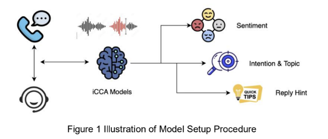
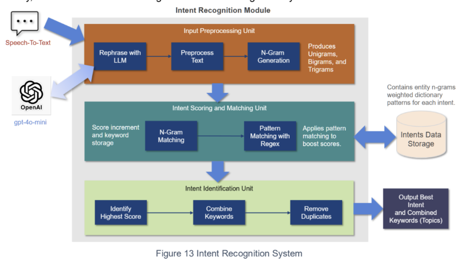
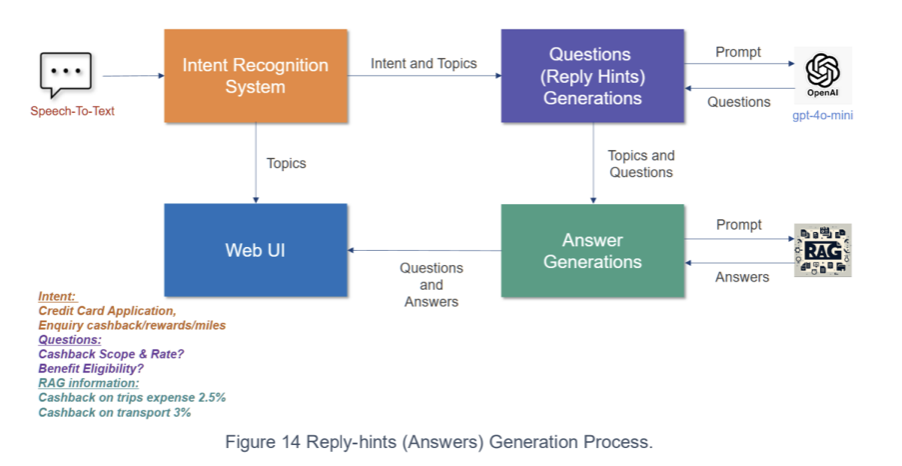
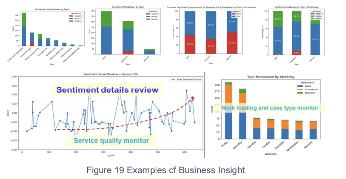
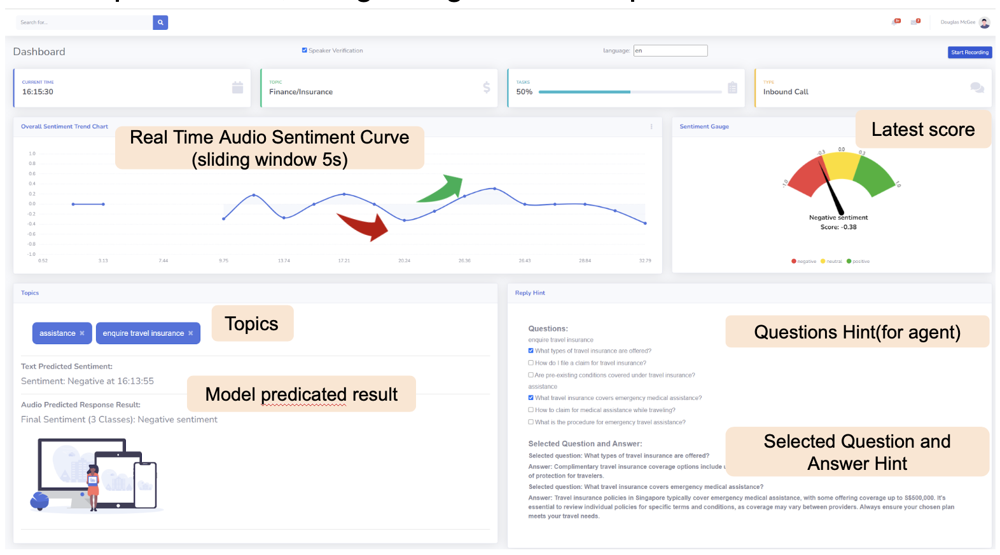

# Intelligent Call Center Assistant System - Audio Sentiment Analysis and Contextual Information Retrieval


### Overall Modules



This project is a cutting-edge audio sentiment analysis system tailored for call centers, 
complemented by advanced text-based capabilities like intention analysis, question generation, 
and information retrieval. 
Designed to enhance customer interactions, the system provides actionable insights in real time.

## Core Features
The application orchestrates multiple models to perform real-time sentiment 
and topic analysis for call center audio streams. 
It uses a FastAPI server with WebSocket endpoints to process 
streaming audio and text inputs efficiently. 
Here’s how it integrates and manages various models:
### Audio Modal
1.	Audio Sentiment Analysis   
Detects sentiment in real-time from audio streams, classifying attitudes 
to enhance understanding of customer moods. 
2. Accent Recognition by self-trained model  
Differentiates between Singaporean English and Native Speaker accents for better acoustic model performance.

It has inherited some enhanced features for [sensevoice](funaudiollm.github.io/):
- **VAD detection**: Identifies active speech segments for efficient processing.
- **real-time streaming recognition**: Transcribes audio streams for downstream text-based analysis.
- **speaker verification**: Verifies speaker identity if agent or customer


### Text Modal
1.	Text Sentiment Analysis: 
transcribed text is queued for analysis by a text sentiment model, 
which evaluates sentiment trends based on linguistic content. 
2. Intention Analysis: 
Identifies user intent from transcribed text to guide responses and 
decision-making. 

3. Question Generation: 
Automatically generates meaningful questions based on key topics 
in the conversation. 
4. Information Retrieval with RAG (Retrieval-Augmented Generation): 
Retrieves contextually relevant responses or data using pre-indexed 
knowledge bases. 
5. Topic Modeling (experiment, unused): 
Clusters and identifies key themes in customer conversations using BERTopic.

6. Summary Insights


### Model Integration and Workflow:
•	Results from all models are synchronized to update live visualizations, 
such as sentiment score timelines, ensuring actionable insights for users.  
•	Text, audio, and topic data are coordinated using global locks and 
asynchronous queues to maintain consistency and avoid conflicts.


## Installation Guide

### Prerequisites
•	Python 3.10 (recommended)
•	Conda package manager/ virtual environment setup
•	Internet connection for downloading dependencies
•	Download Model files from google drive 
[link](https://drive.google.com/drive/folders/12kXs0UzPWwAMT-thXBZ6pGa4gPhSLzMB?usp=share_link)  
•	Setup OpenAI API Key

### Steps
1. clone this repository to your local machine:
```bash
git clone https://github.com/BiancaZYCao/call-center-sentiment-sense.git
cd call-center-sentiment-sense
```
2. Then, install the required dependencies using the following command: 
```bash
conda create -n icca python=3.10
conda activate icca

conda install -c conda-forge ffmpeg

pip install -r requirements.txt # or requirements-mac.txt for MacOS user (M Chip supported)
```
3. Install Dependencies Extra NLTK: 
```python 
import nltk
nltk.download('punkt')
nltk.download('stopwords')
nltk.download("punkt_tab")
nltk.download('wordnet')
```

## Running the Application
### Backend API Server - WebSocket for Real-Time Processing
```bash
python main.py 
```
### Client Page
1.	Open the index.html file in a browser.
2.	Update the wsUrl field to point to your WebSocket server address.


## Project Structure

### Directories
``` plaintext 
├── README.md                        # Project documentation
├── main.py                          # Backend API server script
├── index.html                       # Main frontend interface for WebSocket API
├── requirements.txt                 # Python dependencies for general setups
├── requirements-mac.txt             # Python dependencies specific for macOS
├── stopwords.txt                    # Custom stopwords for text preprocessing
│
├── model_inference/                 # Contains scripts for inference on audio and text models
│   ├── __init__.py                  # Initialization file for the module
│   ├── speech_sentiment.py          # Handles audio-based sentiment analysis
│   ├── text_analysis.py             # Performs topic modeling and question generation
│   └── text_sentiment.py            # Conducts text-based sentiment analysis
│
├── models/                          # Pre-trained models for analysis
│   └── (Model files)
│
├── schema/                          # Defines data models and schema for API requests and responses
│   └── (Schema files)
│
├── speaker/                         # Handles speaker recognition and related tasks
│   └── (Agent audio wav samples)
│
├── static/                          # Stores static assets for the frontend
│
├── test_scripts/                    # Scripts for testing various modules
│
├── utils/                           # Utility functions for audio and text processing
│   ├── __init__.py                  # Initialization file for the module
│   ├── score_adjust.py              # Adjusts sentiment scores based on context
│   ├── speaker_recognition.py       # Handles speaker recognition and analysis
│   ├── speech_feature_extraction.py # Extracts features from audio for analysis
│   ├── text_formatting.py           # Formats text for consistent analysis
│   └── text_preprocessing.py        # Preprocesses text for sentiment and topic analysis
│
├── blank.html                       # Supporting HTML page for frontend
├── charts.html                      # Frontend HTML page for chart visualization
├── lda_vis_with_topics.html         # Frontend HTML for LDA topic visualization
├── login.html                       # Supporting login HTML page
```

## User Manual: Call Center Sentiment Dashboard

### Overview

This dashboard provides real-time insights into customer sentiment during calls, helping agents respond effectively. The key components include sentiment trends, predicted topics, question hints, and selected answers.


### Dashboard Components

1. Real-Time Sentiment Curve

	•	Displays the sentiment trend over time using a sliding window of 5 seconds.
	•	Helps visualize the emotional tone during the conversation.

2. Sentiment Gauge

	•	Shows the current sentiment score.
	•	Ranges from negative (red) to positive (green).

3. Topics

	•	Automatically identifies conversation topics.
	•	Tags such as “assistance” and “enquire travel insurance” help agents focus on key areas.

4. Question Hints

	•	Provides a list of relevant questions for agents to ask customers based on the conversation context.

5. Selected Question and Answer

	•	Displays the most relevant questions and answers for customer inquiries.

### How to Use

1.	Start Recording: Begin tracking a call by clicking the “Start Recording” button.
2.	Monitor Sentiment: Watch the sentiment curve and gauge for emotional trends.
3.	Review Topics: Use the topic suggestions to understand customer intent.
4.	Ask Questions: Refer to the “Questions Hint” section to ask relevant questions.
5.	Provide Answers: Use the “Selected Question and Answer” section to provide accurate responses.

This streamlined interface enhances agent efficiency and ensures a better customer experience.

## Roadmap

- [x]  VAD and STT with SenseVoice - real time with speaker verification
- [x]  Accent Recognition Singaporean English V.S. Native Speaker
- [x]  Text Sentiment
- [x]  Intention Analysis from Transcribed Text
- [x]  Question Generation for Enhanced Interaction
- [x]  Integration with Custom Knowledge Graphs for Richer Retrieval
- [ ]  Advanced Context Summarization for Calls, display charts, etc.


## License

This project is sponsored by NCS, Singapore.   
**Note**: This project should not be used in commercial products without premission. 
It is for educational demo purposes only.
